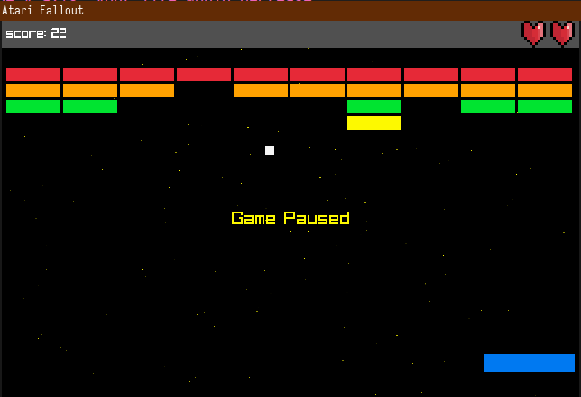

### What Is This?

Atari Breakout But The Tiles Are Falling Down.

### Rules Of The Game:

    - Missing the bullet(or ball?), decreases how many lifes you have left
    - If any tile goes beyond the y-axis, your life would decrease
    - A Red tile gives 4 points
    - An Orange tile gives 3 points
    - A Green tile gives 2 points
    - A Yellow tile gives 1 point
    - If you die in atari fallout, you die in real life :)

### How to run

- Grab the binary and game resources for your operating system from [here](https://github.com/Uzo2005/atariFallout/releases/tag/v.1)

### Building From Source

1. [Install](https://nim-lang.org/install.html) Nim.
2. Clone this repo: `git clone https://github.com/Uzo2005/atariFallout.git`
3. Go into the directory `cd atariFallout`
4. Run `nimble install`, to install the `naylib` dependency(raylib bindings for nim by the awesome @planetis-m)
5. Run `nim c -d:release -o:atariFallout main.nim`
6. Run the generated binary `./atariFallout`

### How To Play
- Move left and right with the arrow keys or using keys `A` and `D`
- Pause and Resume game with `SpaceBar`
- Use `Tab` for selecting multichoice input
- Use `Enter` to select input
